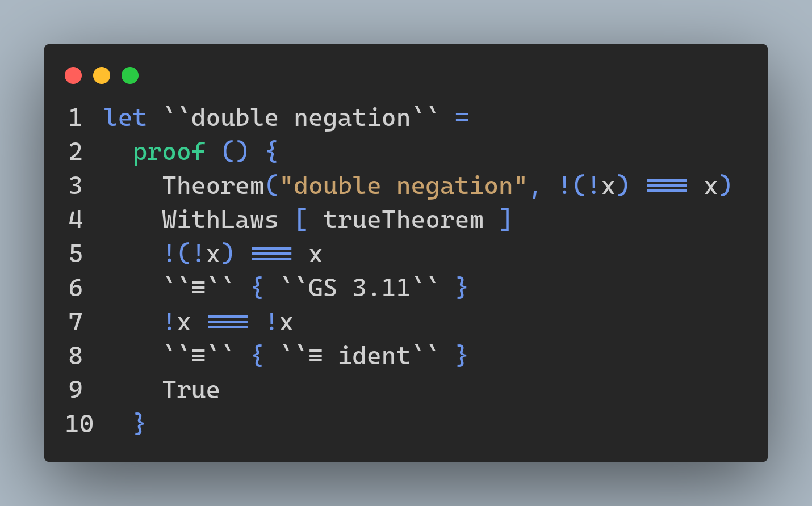

# Wybe

A proof checker embedded in F#'s computation expressions

## Features and progress:

- Check proofs written in a syntax inspired by [Dijkstra's predicate calculus][0]
  - [ ] [A Logical Approach to Discrete Math][1]
    - [ ] [Basic proofs](./Wybe/GriesSchneider/Theorems.fs)
  - [ ] Lambda calculus interpreter to transform expressions
  - [ ] Sets, ∀, ∃
  - [ ] [Relational calculus][2]

## Examples

[0]: https://www.cs.utexas.edu/users/EWD/transcriptions/EWD13xx/EWD1300.html
[1]: https://books.google.de/books/about/A_Logical_Approach_to_Discrete_Math.html?id=ZWTDQ6H6gsUC
[2]: http://www.mathmeth.com/files/calc_collection.pdf