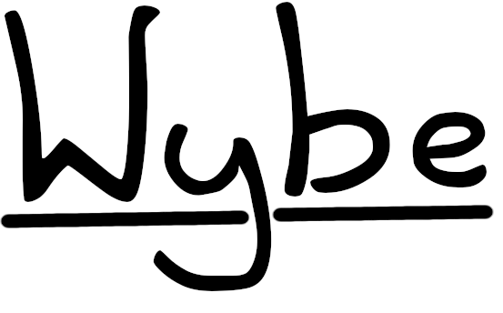

# Wybe



A theorem prover embedded in F#'s computation expressions, using [Z3][3] under the hood

## Features and progress

- [ ] Check proofs written in a syntax inspired by [Dijkstra's predicate calculus][0]
  - [ ] [A Logical Approach to Discrete Math][1]
    - [x] [Basic predicate calculus proofs](./Prover/GriesSchneider/PredicateCalculus.fs)
    - [ ] Integers
    - [ ] Sequences
  - [ ] [Relational calculus](./documents/calc_collection.pdf)
  - [ ] Functions

- [ ] Extract proof obligations from
  - [ ] Rust
  - [ ] F#
  - [ ] Golang

## Installation instructions

- Install Antlr4 (in Debian it works with `sudo apt install antlr4`)
- Install the [dotnet 9](https://dotnet.microsoft.com/en-us/download) CLI
- Clone this repository locally

## Example workflow

1. create a Rust file with functions and declare their properties as assertions in the source code. We will be using the example functions in `example_functions.rs`

2. extract proof obligations to an F# script, in this case `example_functions.fsx`

    ```sh
    cd wybe/experiments
    dotnet run --project ../Tool/Tool.fsproj -- -e example_functions.rs
    ```

3. complete the necessary steps to prove all the theorems in `example_functions.fsx`, i.e. if checking a proof fails then more detailed calculations and hints must be provided.

4. check the proofs in `example_functions.fsx`

    ```sh
    dotnet fsi example_functions.fsx
    ```

5. if the output indicates success, you have formally verified all declared properties of the Rust functions in `example_functions.rs`.
6. add more functions to `example_functions.rs` or modify existing ones
7. continue extracting proof obligations, completing and checking the proofs

Note: once the Wybe CLI is published as a NuGet package and installed, you can simply run `wybe -e example_functions.rs` to extract proof obligations and `wybe -c example_functions.fsx` to check proofs.

## Example proof


[0]: https://www.cs.utexas.edu/users/EWD/transcriptions/EWD13xx/EWD1300.html
[1]: https://books.google.de/books/about/A_Logical_Approach_to_Discrete_Math.html?id=ZWTDQ6H6gsUC
[3]: https://github.com/Z3Prover/z3
