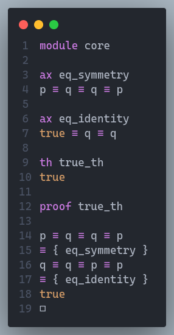

# Wybe

Features and progress:

- Check proofs written in a syntax inspired by [Dijkstra's predicate calculus][0]
  - [x] Parsing syntax
  - [ ] Checking proofs
- Support for VS Code
- Support for Sublime Text

[0]: https://www.cs.utexas.edu/users/EWD/transcriptions/EWD13xx/EWD1300.html