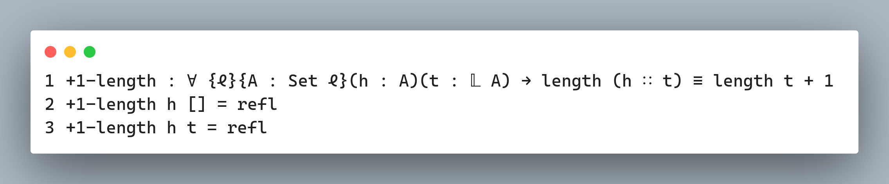

# Formal verification for the masses

---

# Testing vs Proving

```
2 + 2                         |      x + x  
= { addition rules }          |    = { basic algebra } 
4                             |      2 * x  
```

---

# Rules for transforming programs

```
  if ¬true then A else B
= { applying ¬ }
  if false then A else B
= { semantics of the if statement }
  B
```
---

# Smart contracts

- It's important to sleep at night if you're responsible for a smart contract holding valuable assets

- Formal verification can and has been applied successfully to make more secure smart contracts

---

# Formal Land

- Ethereum, Tezos, Sui, Aleph Zero


---

# Why it's not used more?

- Dependent types
- Niche platforms and languages
- PhD level knowledge



---

# A bridge

- F# and .NET
- Simpler yet powerful language
- A work in progress


---

# Reactions


---

# Reactions


---

# Reactions


---

# 10 years ago

https://eltoque.com/programar-sin-computadora


---

# Questions?

- https://github.com/lamg