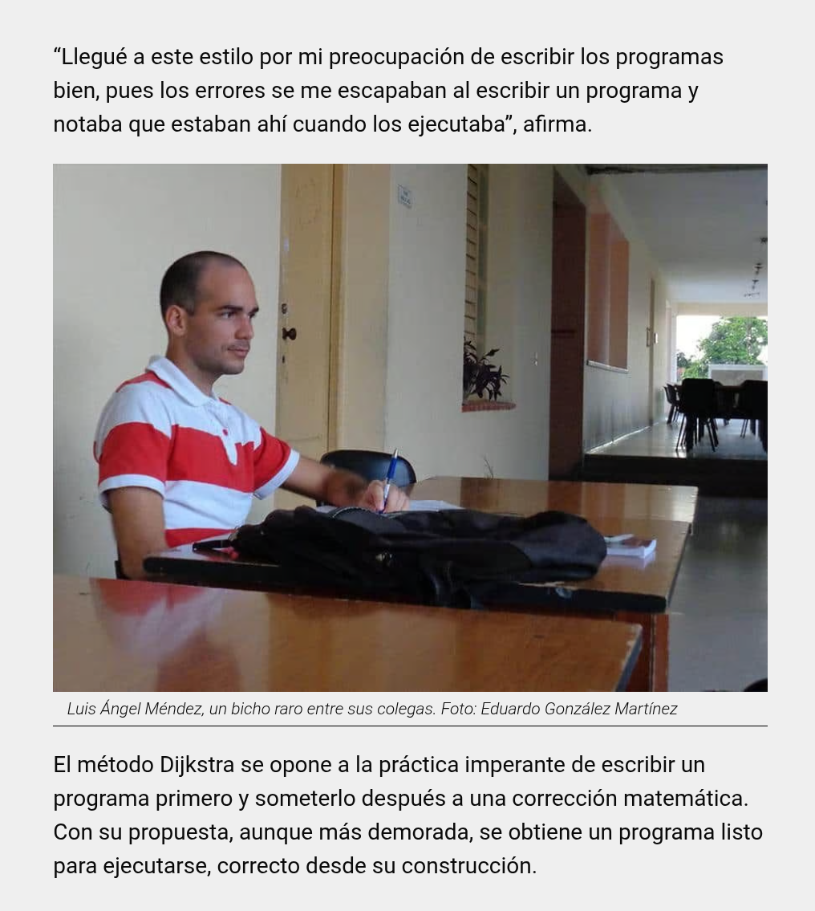

# Making formal verification accessible to all

---

## What is formal verification?

- Mathematical formulas are universally true

```fs
2 + 2 = 4
```

---

## Programs can be mathematical formulas

```fs
  if ¬true then A else B
↦ { applying ¬ }
  if false then A else B
↦ { semantics of the if statement }
  B
```

---

## Zero program errors, but no 100% security

---

## How can it be done


---

## Wybe, an accessible and powerful tool


---

## Post interactions X


---

## Post interactions in LinkedIn


---

## Stars in GitHub


---

## The team

- 10 years ago



<https://eltoque.com/programar-sin-computadora>
